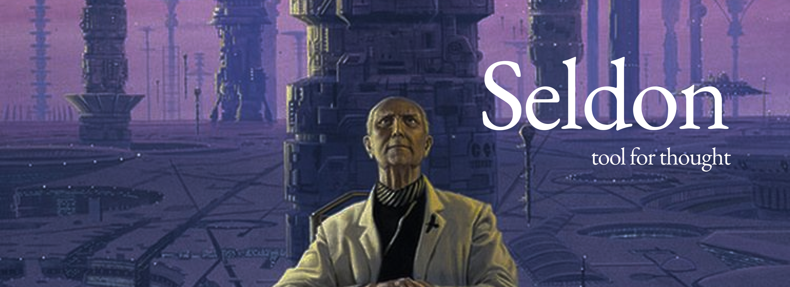

# seldon, a tool for thought



---

## 1. Entering the app

Open the home page. Read it. Click anywhere to enter the graph.

## 2. Workspaces

Top left of the graph panel is a dropdown showing the current workspace name. Click it to switch between workspaces.

Two types of workspaces:

- **General (default)** — A free-form thinking space. Notes are laid out using force-directed graph layout — nodes repel each other and edges pull connected nodes together. No time axis. Good for ideas, concepts, observations, anything.
- **Time-aware** — Notes are placed along a horizontal time axis. Each note carries a time label (year, month, or exact date). Good for tracking how your thinking evolved over time, journaling, research timelines.

A default workspace called "humans (default)" is pre-seeded on first launch to show what the graph looks like with real content.

## 3. Adding a note (via app)

Click **+ Add Note** on the floating island at the bottom of the graph. A form opens (floating, top right). Fill in:

- **Note text** — your thought, observation, or idea. Plain text.
- **Tags** — add `#hashtags` anywhere in the text — they are automatically extracted and stored as tags on the note.
- **Time** *(time-aware workspaces only)* — enter a date, month, or year, e.g. `2017`, `June 2017`, `2017-06-12`.

Click **Add Note** to save. The note appears on the graph immediately.

## 4. Adding a note (via Telegram) — primary method

Seldon is primarily designed to be used with Telegram as the input interface. You can text Seldon from anywhere, anytime — on your phone, on your commute, mid-conversation, in the middle of the night. Any thought, any length.

Just send a message to your Seldon Telegram bot. When you click **Poll Telegram** in the app, it fetches all new messages and adds them as notes to your graph.

Notes are automatically classified by length:

| Length | Type |
|---|---|
| Up to 140 characters | `line` |
| 141–400 characters | `idea` |
| 401–1500 characters | `thought_piece` |
| 1500+ characters | `document` |

## 5. Adding tags via Telegram

Add `#hashtags` anywhere in your Telegram message.

> `consciousness might be substrate-independent #philosophy #mind`

Tags are extracted automatically and stored on the note. They are stripped from the display text but visible in the tag list.

## 6. Switching / creating a workspace via Telegram

You can manage workspaces directly from Telegram without opening the app.

| Command | Action |
|---|---|
| `switch to <name>` | Switch to an existing workspace |
| `switch workspace to <name>` | Create a new general workspace and switch |
| `switch workspace to timeaware <name>` | Create a new time-aware workspace and switch |

After switching, all subsequent Telegram messages go into that workspace.

## 7. Message types supported from Telegram

Currently: **text only**. Images, voice notes, and files via Telegram are not supported yet.

Special commands:
- `switch to <name>`
- `switch workspace to <name>`
- `switch workspace to timeaware <name>`

**Topic nodes** — prefix your message with `topic: ` to create a topic node instead of a note.
> `topic: philosophy of mind`

Topic nodes act as cluster anchors in the graph.

## 8. How edges are created

When you add a note (via app or Telegram), edges are not created automatically. You create them two ways:

**Manual** — Click any node on the graph — it becomes the edge source. Click a second node — it becomes the target. The edge form appears in the top-right panel. Fill in:
- **Edge Note** — a free-form description of the relationship (e.g. `this challenged my earlier assumption`). Max 300 characters. Defaults to `related-somehow`.
- **Weight** — 0–100 slider. How strong the connection is. Default 10.

**Automatic** — Click the **Generate Edges** button on the floating island. The app runs edge creation methods across your notes and proposes edges. You review and accept or reject them.

## 9. Viewing and editing a note

Click any node on the graph. A floating card appears at the top right showing:

- **Image** *(if attached)* — displayed at the top of the card, WhatsApp-style. Click **+ Add image** to attach one; click **×** to remove it. One image per note. The image also appears as a thumbnail on the node card in the graph.
- **Note text** — editable. Click to type, auto-expands to fit content.
- **Tags** — each with an **×** button to remove. Type a tag in the add field and press Enter to add a new one. In Developer Mode, linker tags are shown read-only instead.
- **Save button** — persists text and tag changes to the database.
- **Narrative** *(if generated — see section 15)*

## 10. Path tracing

Click the path icon on the floating island. Click any node to set it as root. The app traces all paths outward from that node. The root is highlighted in red; traced nodes and edges in orange; everything else fades. Click the button again to turn off.

## 11. Generate edges

Runs automated edge detection across all notes in the current workspace. After running, a proposal drawer opens with suggested edges — source node, target node, edge type, and confidence score. Accept or reject each one. Accepted edges are saved to the graph.

## 12. Review links

Opens the proposal drawer to review pending edge proposals that were generated but not yet accepted or rejected.

## 13. Advanced tab

Accessible via the **Advanced** link (bottom right). Two sections: Traversal and Edge Creation. Each method has a live form — fill in the fields and hit Send to call the API directly and see the raw JSON response.

### Traversal methods

| Method | Description |
|---|---|
| **Node Neighborhood** | All nodes directly connected to a given node. Parameters: `node_id`, `direction`, `edge_type`, `limit`. |
| **Subgraph Fetch** | Full connected subgraph from a root node to a given depth. Parameters: `node_id`, `depth`, `limit`, `edge_type`. |
| **Weighted Traversal** | Like Subgraph Fetch but returns a `path_score` per node, favouring high-weight paths. |
| **Topic Traversal** | Starts from a topic node, returns all notes connected to it. |
| **Outline Planning** | Groups a subgraph by edge type, returning a structured sectioned outline. |

### Edge creation methods

| Method | Description |
|---|---|
| **Tag Matcher** | Compares LLM-generated internal keywords across note pairs. Requires local Ollama. |
| **Embedding Matcher** | Cosine similarity over sentence embeddings. |
| **LLM Matcher** | LLM scores each candidate pair directly. |
| **LLM Debator** | Three-model debate (for / against / judge). Most rigorous. |
| **Hub Matcher** | Clusters notes into emergent meaning hubs. |

## 14. Developer mode

Click **Developer Mode** (bottom right).

- **Off** — shows user-visible tags (the `#hashtags` you wrote).
- **On** — shows internal linker tags — hidden LLM-generated keywords used for edge creation. Useful for debugging why two notes did or didn't get connected.

## 15. Generate narrative *(hidden in deployed version)*

Available when running with a local Ollama model. Click the book icon on the floating island. Select a note — the app traverses connected nodes up to depth 2, collects the subgraph, and sends it to the LLM asking for a short 2-paragraph narrative in the voice of someone narrating the evolution of your thought. The narrative appears inside the note card. Hidden in production because Ollama is not available in the cloud.

## 16. Graph navigation

- Two-finger drag on trackpad: pan
- Pinch / ctrl+scroll: zoom in and out, centered on cursor
- Click a node: opens the note card
- Click and drag a node: move it on the canvas. Position is saved and restored on refresh.

## 17. Node layout

- **General workspaces** — force-directed layout. Notes repel each other, edges pull connected notes together.
- **Time-aware workspaces** — horizontal timeline layout. Notes placed along a time axis by date label.

## 18. Export graph

Click **Export** in the meta bar (bottom right). Downloads the current workspace as `seldon-{workspace-name}.json` containing:

```
workspace     display name
exported_at   ISO 8601 timestamp
nodes         id, type, raw_text, tags
edges         id, source, target, type, weight, confidence, evidence
```

Scoped to the currently active workspace only.

---

## Not yet supported

- Images, voice notes, or files via Telegram *(images can be attached via the app)*
- Shift+click to create edges *(planned)*
- Real-time auto-polling from Telegram *(currently manual poll)*
- Narrative generation in the deployed version *(Ollama dependency)*
